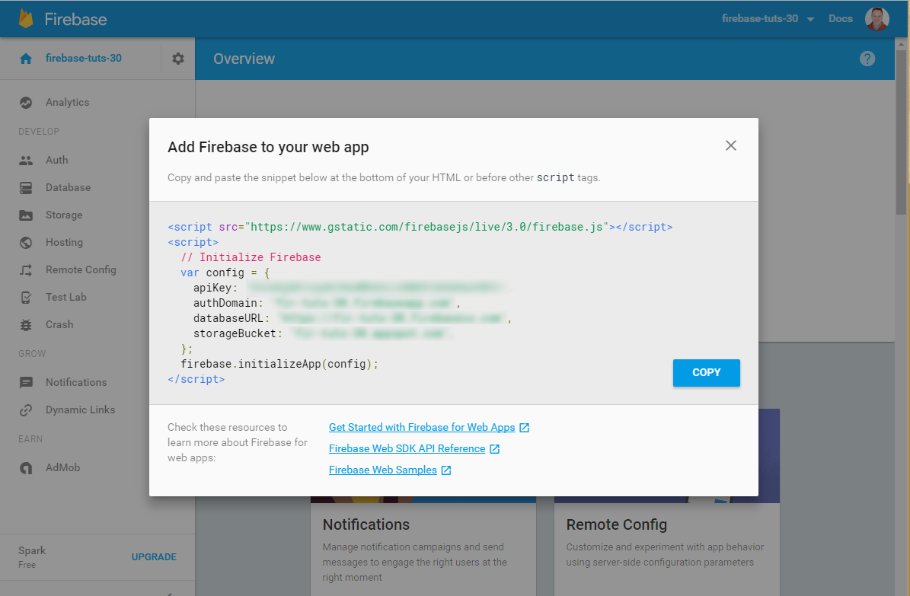
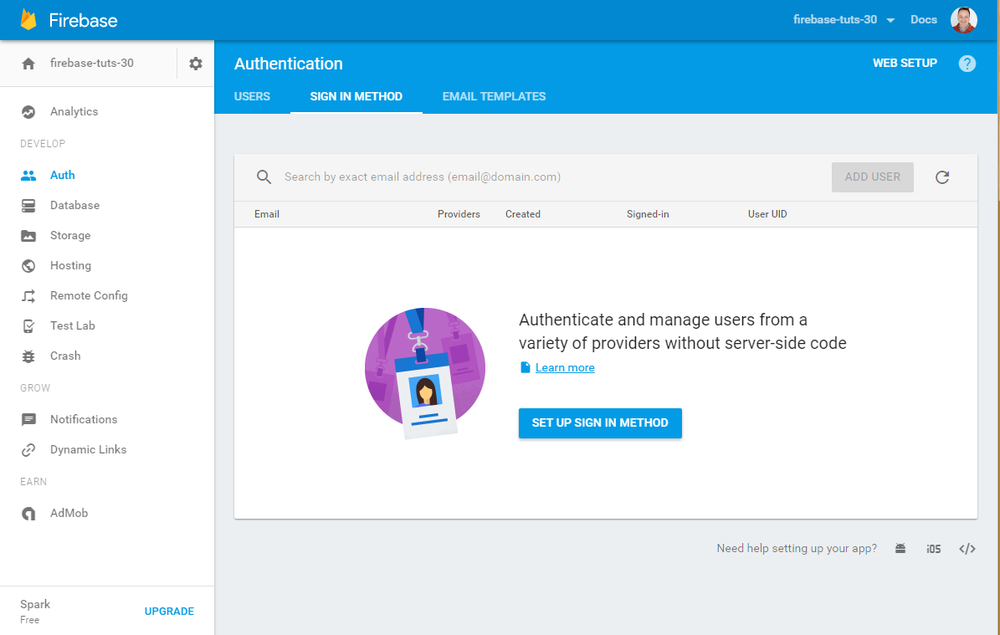
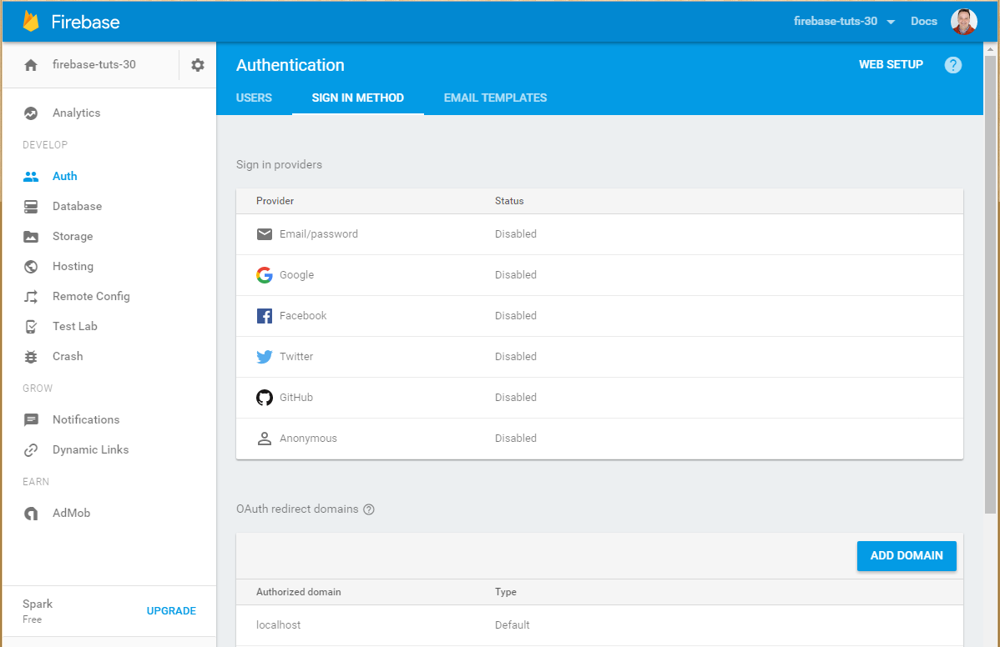

# Firebase Tutorial 3.0
Firebase Tutorial Code for Version 3.0

* Create a new repo in GitHub
* Clone repository on your local machine
* Add .gitignore
 * /node_modules/\*\*/\*
 * /dist/\*\*/\*
 * *.log
* Create src directory
* Create src/less
* Create src/scripts
* Create index.html
* Create main.less (under src/less)
* Create app.js (under src/scripts)
* run npm init
* npm install --save-dev gulp gulp-less gulp-connect gulp-open
* create gulpfile.js
* git add .
* git commit -m "Initial Commit for Build"

# Firebase Setup

* Create New Project on Firebase


* Add config and initializeApp in app.js


```javascript
// Initialize Firebase
var config = {
    apiKey: "",
    authDomain: "",
    databaseURL: "",
    storageBucket: "",
};
firebase.initializeApp(config);
```

* Add script link in index.html
```html
<script src="https://www.gstatic.com/firebasejs/live/3.0/firebase.js"></script>
```

* From Terminal:
 * firebase login
 * firebase init
 * firebase deploy

# Adding Google Auth

* Login to firebase console
* Click on Auth on the left
* Click on Sign-in Method

* Click on Google

* Click on enable, and save


Yes, it's that easy, it creates all the keys you need on the [https://console.developers.google.com](https://console.developers.google.com)

#Firebase Database Essentials

##Write to your Firebase Database
```javascript
//Get A reference to your Database
var myCollection = firebase.database().ref('MyCollection');

//Push an object to your collection
myCollection.push({ name: 'alex'});
```


##To Read from a collection
```javascript
database.ref('MyCollection').on('value', function (results) {
var colectionData = results.val();
// iterate through results coming from database call; messages
for (var item in collectionData) {
    //NOTE: item is actually the key, so use that for data-id in your html
    $list = $('<li></li>')
    $list.attr('data-id',item);
    //You'll probably want to put something from your item like:
    $list.append('<div></div>').html(item.name);
    $('#results').append($list);
}
```

##To Update a collection
```javascript
//The id is the key of the item in the collection
var myCollection = database.ref('/MyCollection/' + id);

// update name property
myCollection.update({
    name: 'julio'
})
```

##To Delete from a collection
```javascript
//The id is the key of the item in the collection
var myCollection = database.ref('/MyCollection/' + id);

// update name property
myCollection.remove();
```
